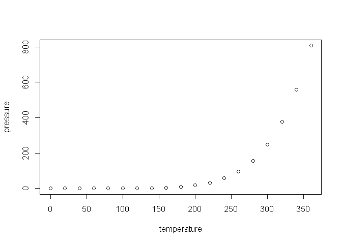

plantas de oxidacion de acido nitrico y amoniaco 1950160
================

## planta de oxidacion

en este trabajo podemos observar los siquientes datos , que posee un un
marco de datos con 21 observaciones sobre 4 variables. Las variables
están representadas de la siguiente forma: Air Flow representa la tasa
de funcionamiento de la planta. Water Temp es la temperatura del agua de
refrigeración que circula a través de bobinas en la torre de absorción.

``` r
data("stackloss")
force(stack.loss)
```

    ##  [1] 42 37 37 28 18 18 19 20 15 14 14 13 11 12  8  7  8  8  9 15 15

``` r
force(stack.x)
```

    ##       Air.Flow Water.Temp Acid.Conc.
    ##  [1,]       80         27         89
    ##  [2,]       80         27         88
    ##  [3,]       75         25         90
    ##  [4,]       62         24         87
    ##  [5,]       62         22         87
    ##  [6,]       62         23         87
    ##  [7,]       62         24         93
    ##  [8,]       62         24         93
    ##  [9,]       58         23         87
    ## [10,]       58         18         80
    ## [11,]       58         18         89
    ## [12,]       58         17         88
    ## [13,]       58         18         82
    ## [14,]       58         19         93
    ## [15,]       50         18         89
    ## [16,]       50         18         86
    ## [17,]       50         19         72
    ## [18,]       50         19         79
    ## [19,]       50         20         80
    ## [20,]       56         20         82
    ## [21,]       70         20         91

``` r
force(stackloss)
```

    ##    Air.Flow Water.Temp Acid.Conc. stack.loss
    ## 1        80         27         89         42
    ## 2        80         27         88         37
    ## 3        75         25         90         37
    ## 4        62         24         87         28
    ## 5        62         22         87         18
    ## 6        62         23         87         18
    ## 7        62         24         93         19
    ## 8        62         24         93         20
    ## 9        58         23         87         15
    ## 10       58         18         80         14
    ## 11       58         18         89         14
    ## 12       58         17         88         13
    ## 13       58         18         82         11
    ## 14       58         19         93         12
    ## 15       50         18         89          8
    ## 16       50         18         86          7
    ## 17       50         19         72          8
    ## 18       50         19         79          8
    ## 19       50         20         80          9
    ## 20       56         20         82         15
    ## 21       70         20         91         15

``` r
stackloss
```

    ##    Air.Flow Water.Temp Acid.Conc. stack.loss
    ## 1        80         27         89         42
    ## 2        80         27         88         37
    ## 3        75         25         90         37
    ## 4        62         24         87         28
    ## 5        62         22         87         18
    ## 6        62         23         87         18
    ## 7        62         24         93         19
    ## 8        62         24         93         20
    ## 9        58         23         87         15
    ## 10       58         18         80         14
    ## 11       58         18         89         14
    ## 12       58         17         88         13
    ## 13       58         18         82         11
    ## 14       58         19         93         12
    ## 15       50         18         89          8
    ## 16       50         18         86          7
    ## 17       50         19         72          8
    ## 18       50         19         79          8
    ## 19       50         20         80          9
    ## 20       56         20         82         15
    ## 21       70         20         91         15

## Including Code

You can include R code in the document as follows:

``` r
summary(cars)
```

    ##      speed           dist       
    ##  Min.   : 4.0   Min.   :  2.00  
    ##  1st Qu.:12.0   1st Qu.: 26.00  
    ##  Median :15.0   Median : 36.00  
    ##  Mean   :15.4   Mean   : 42.98  
    ##  3rd Qu.:19.0   3rd Qu.: 56.00  
    ##  Max.   :25.0   Max.   :120.00

## Including Plots

You can also embed plots, for example:

<!-- -->

Note that the `echo = FALSE` parameter was added to the code chunk to
prevent printing of the R code that generated the plot.
